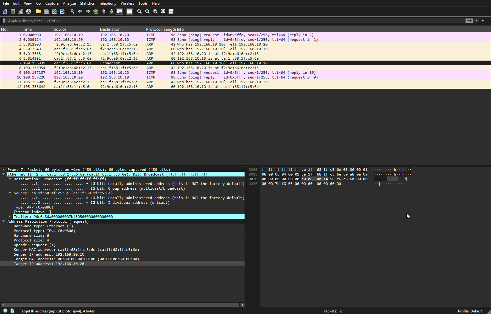
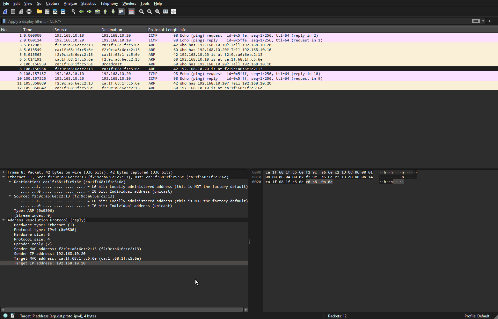
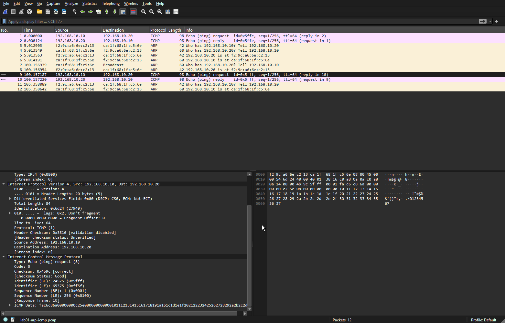
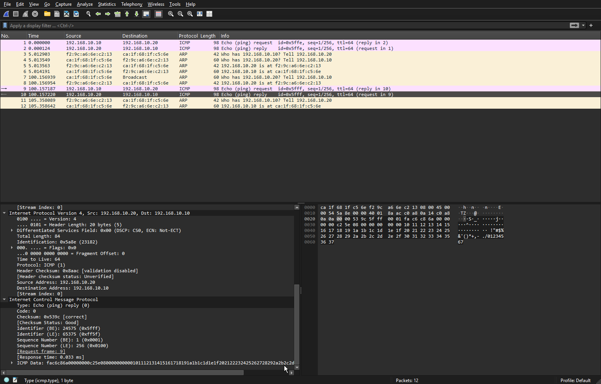

# LAB 01 — Basic Network Connectivity

**Environment:** Kathara · Docker · Linux  
**Tools:** PowerShell · tcpdump · Wireshark  
**Protocols:** Ethernet · ARP · IPv4 · ICMP

## Overview

This lab explores communication between two Linux hosts connected to the same virtual Ethernet network in Kathara. It covers static IPv4 addressing, connectivity testing, ARP resolution, ICMP packet exchange, and packet inspection with tcpdump and Wireshark.

**Objectives**

- Build a two-host virtual LAN using Kathara.
- Configure static IPv4 addresses through startup scripts.
- Verify connectivity with `ping`.
- Observe ARP Requests and Replies.
- Capture and analyze ICMP Echo Requests and Replies.
- Keep the configuration reproducible and the evidence available for review.

## 1. Network Topology

```text
                 Collision domain A
                  192.168.10.0/24

       +----------------+   +----------------+
       |      PC1       |   |      PC2       |
       |                |   |                |
       | eth0           +---+ eth0           |
       | 192.168.10.10  |   | 192.168.10.20  |
       +----------------+   +----------------+
```

| Host | Interface | IPv4 address | Subnet |
| --- | --- | --- | --- |
| PC1 | `eth0` | `192.168.10.10` | `/24` |
| PC2 | `eth0` | `192.168.10.20` | `/24` |

Both hosts share the same subnet and Ethernet collision domain. No router is required for their communication.

## 2. Project Files

```text
01-basic-connectivity/
├── README.md
├── lab.conf
├── pc1.startup
├── pc2.startup
├── screenshots/
│   ├── 01-arp-request.png
│   ├── 02-arp-reply.png
│   ├── 03-icmp-request.png
│   └── 04-icmp-reply.png
└── shared/
    └── lab01-arp-icmp.pcap
```

The `.pcap` file contains the captured packets for independent analysis in Wireshark.

## 3. Kathara Configuration

**`lab.conf`** — Connects both hosts to collision domain `A`.

```ini
pc1[0]=A
pc2[0]=A
```

**`pc1.startup`** — Assigns PC1's IPv4 address.

```bash
ip addr add 192.168.10.10/24 dev eth0
```

**`pc2.startup`** — Assigns PC2's IPv4 address.

```bash
ip addr add 192.168.10.20/24 dev eth0
```

Kathara executes the `.startup` scripts when the lab starts. This avoids re-entering each IP configuration manually after recreating the containers.

## 4. Run the Lab

Run the following commands in PowerShell **from this lab directory**.

**Start both machines:**

```powershell
kathara lstart --noterminals
```

**Inspect their interfaces:**

```powershell
kathara exec pc1 "ip -br addr"
kathara exec pc2 "ip -br addr"
```

**Test connectivity from PC1 to PC2:**

```powershell
kathara exec pc1 "ping -c 4 192.168.10.20"
```

**Stop and clean up the lab when finished:**

```powershell
kathara lclean
```

## 5. Connectivity Results

The four-packet test from PC1 to PC2 returned:

```text
4 packets transmitted, 4 received, 0% packet loss, time 3004ms
rtt min/avg/max/mdev = 0.784/0.888/1.078/0.112 ms
```

| Metric | Recorded result |
| --- | ---: |
| Packets sent | 4 |
| Packets received | 4 |
| Packet loss | 0% |
| Minimum RTT | 0.784 ms |
| Average RTT | 0.888 ms |
| Maximum RTT | 1.078 ms |

**Result:** PC1 successfully reached PC2 within the virtual LAN. The latency values describe this local virtual environment and are not measurements of a physical network.

## 6. Packet Capture

Traffic was captured on PC2 using `tcpdump`:

```bash
tcpdump -i eth0 -nn -e -w /shared/lab01-arp-icmp.pcap 'arp or icmp'
```

| Option | Meaning |
| --- | --- |
| `-i eth0` | Capture on interface `eth0` |
| `-nn` | Disable address and port name resolution |
| `-e` | Include link-layer details when printing packets |
| `-w` | Write packets to a capture file |
| `arp or icmp` | Capture only ARP or ICMP traffic |

To trigger new ARP resolution, the neighbor cache was cleared on PC1 before sending a ping:

```powershell
kathara exec pc1 "ip neigh flush dev eth0"
kathara exec pc1 "ping -c 1 192.168.10.20"
```

The resulting capture is available at [`shared/lab01-arp-icmp.pcap`](shared/lab01-arp-icmp.pcap) and contains **12 packets**, including ARP and ICMP traffic.

> Note: Captured MAC addresses can change when Kathara recreates the containers.

## 7. ARP Analysis

ARP allows a host to discover the Ethernet MAC address corresponding to an IPv4 address on its local network.

### ARP Request — Packet 7

PC1 broadcasts a question to the LAN:

> Who has 192.168.10.20? Tell 192.168.10.10

| Field | Captured value |
| --- | --- |
| Sender IP | `192.168.10.10` |
| Sender MAC | `ca:1f:68:1f:c5:6e` |
| Target IP | `192.168.10.20` |
| ARP target MAC | `00:00:00:00:00:00` |
| Ethernet destination MAC | `ff:ff:ff:ff:ff:ff` (broadcast) |
| ARP Opcode | `1` (Request) |



### ARP Reply — Packet 8

PC2 responds directly to PC1:

> 192.168.10.20 is at f2:9c:a6:6e:c2:13

| Field | Captured value |
| --- | --- |
| Sender IP | `192.168.10.20` |
| Sender MAC | `f2:9c:a6:6e:c2:13` |
| Target IP | `192.168.10.10` |
| Ethernet destination MAC | `ca:1f:68:1f:c5:6e` (unicast) |
| ARP Opcode | `2` (Reply) |



**Observation:** The Request uses an Ethernet broadcast because PC1 does not yet know PC2's MAC address. The Reply uses unicast because PC2 knows the requesting host's MAC address.

## 8. ICMP Analysis

The `ping` command uses ICMP messages to check reachability.

### ICMP Echo Request — Packet 9

| Field | Captured value |
| --- | --- |
| Source IPv4 | `192.168.10.10` (PC1) |
| Destination IPv4 | `192.168.10.20` (PC2) |
| IPv4 Protocol | `1` (ICMP) |
| TTL | `64` |
| ICMP Type | `8` (Echo Request) |
| ICMP Code | `0` |



### ICMP Echo Reply — Packet 10

| Field | Captured value |
| --- | --- |
| Source IPv4 | `192.168.10.20` (PC2) |
| Destination IPv4 | `192.168.10.10` (PC1) |
| IPv4 Protocol | `1` (ICMP) |
| TTL | `64` |
| ICMP Type | `0` (Echo Reply) |
| ICMP Code | `0` |



**Observation:** Source and destination IP addresses are reversed in the reply. The Request and Reply share the same ICMP Identifier and Sequence Number, allowing them to be matched.

### Encapsulation

In the captured ICMP Request, the protocol layers are nested:

```text
Ethernet II frame                   98 bytes
├── Ethernet header                 14 bytes
└── IPv4 packet                     84 bytes
    ├── IPv4 header                 20 bytes
    └── ICMP message                64 bytes
        ├── ICMP header              8 bytes
        └── Payload                 56 bytes
```

Wireshark reports an **IPv4 Total Length of 84 bytes** because that field excludes the Ethernet header.

## 9. Troubleshooting Notes

| Issue | Cause | Resolution |
| --- | --- | --- |
| Invalid collision domain | A name containing spaces was used | Use the alphanumeric domain `A` |
| Interface configuration error | `eth 0` was entered instead of `eth0` | Use the exact Linux interface name |
| ARP discovery absent from initial packets | A neighbor mapping may already be cached | Flush the neighbor cache and retry |
| Configuration lost after recreation | IP addresses were entered manually | Define host configuration in `.startup` files |

## 10. Lessons Learned

- Hosts sharing one IP subnet and Ethernet segment can communicate without a router.
- IPv4 addresses identify network-layer endpoints; MAC addresses identify link-layer interfaces.
- ARP Requests commonly use Ethernet broadcast; ARP Replies can use unicast.
- ICMP Type `8` is an Echo Request; Type `0` is an Echo Reply.
- `tcpdump` collects packet evidence; Wireshark helps interpret it.
- Startup scripts make network labs easier to reproduce and troubleshoot.

## 11. Next Steps

Future exercises will extend this environment with routing between subnets, additional hosts, network services, traffic filtering, and automated tests.

---

**Lab status:** Connectivity and packet analysis completed.  
**Project:** [Networking Labs](../../README.md)
